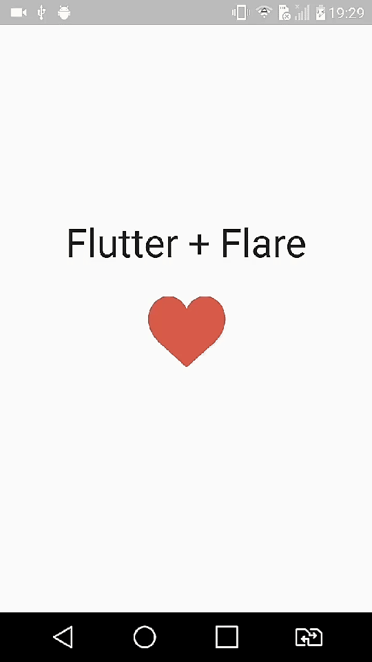

 <p align="center">
      
</p>

<h1 align="center">Flare - Rive</h1>

<h2 align="center">About 📖</h2>
   
<p align="center">   
   A simple test developed with Flutter and <a href="https://rive.app/explore/popular/trending/all">Flare</a>. 💙<br>
   That was a simple with Flare, today Rive, together with Flutter, a simple test, and it made me learn more.
</p>

---

<h2 align="center">Preview 📱</h2><br>
   
   <p align="center">
    
   </p>
   
   > * See also in [`demo`](https://github.com/felipecastrosales/Flare-Test/tree/master/demo) folder. 🧐📂

---

<h2 align="center">How to Use 🤔</h2>

   ```   
   - Clone this repository:
   $ git clone https://github.com/felipecastrosales/Flare-Test Flare-Test

   - Enter in directory:
   $ cd Flare-Test

   - For install dependencies:
   $ flutter packages get

   - Run the app: 
   $ flutter run
   ```

---

<h2 align="center">License 📝</h2>

   This repository is under MIT license. You can see the [LICENSE](https://github.com/felipecastrosales/Flare-Test/blob/master/LICENSE) file for more details. 😉

   ---

   >This project was developed with ❤️ by **[@Felipe Sales](https://www.linkedin.com/in/felipecastrosales/)**, with the instructor **[Daniel Ciolfi](https://linkedin.com/in/danielciolfi)**, in the course  **["Criação de Apps Android e iOS com Flutter 2021-Crie 14 Apps"](https://www.udemy.com/course/curso-completo-flutter-app-android-ios/?referralCode=1355952A966260D40D18)** on **[Udemy](https://www.udemy.com/)**.<br>
   If it helped you, give ⭐, contribute, it will help me too 😉

---

   <div align="center">

   [](https://www.linkedin.com/in/felipecastrosales/)

   </div>
